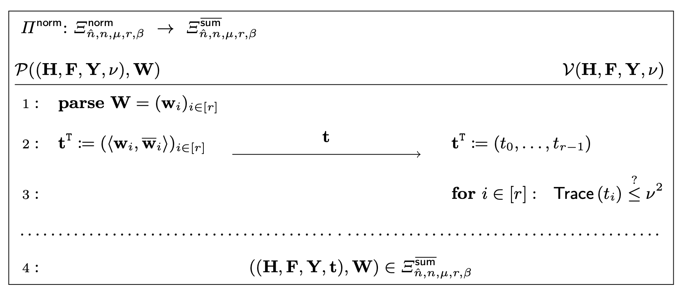
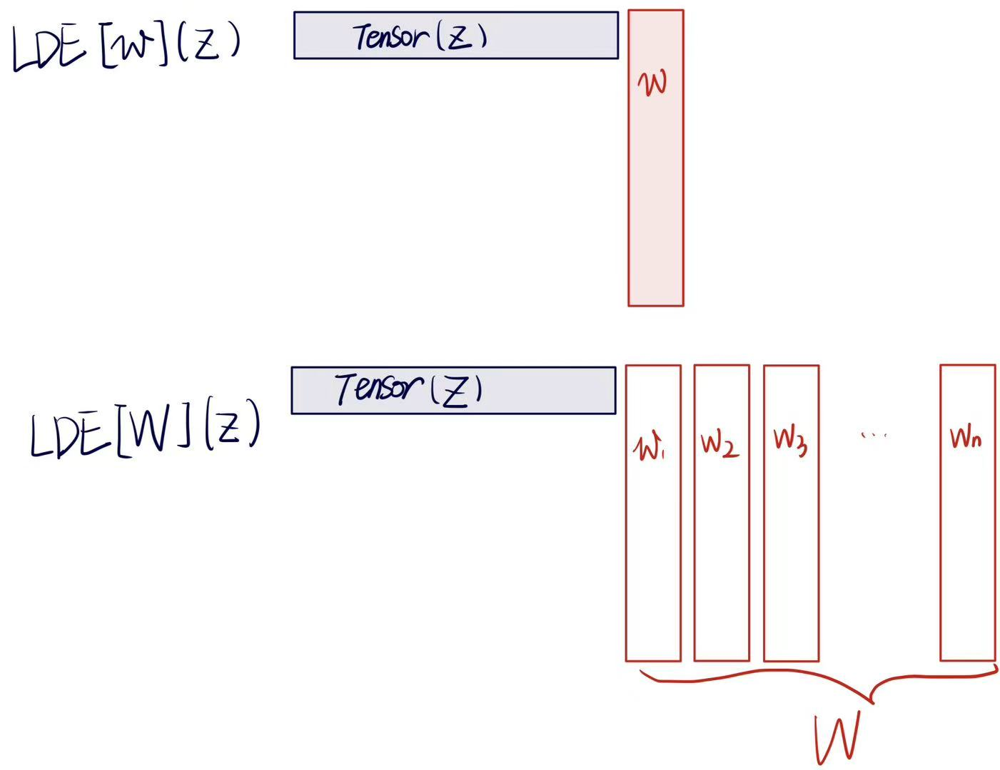
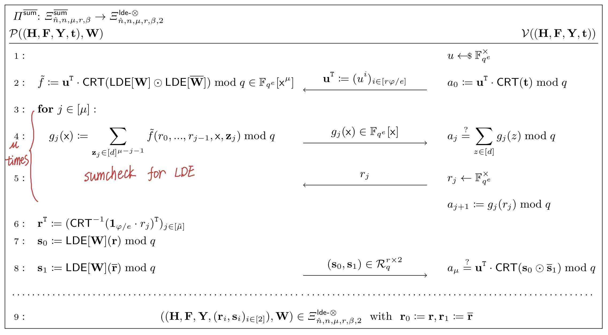

---
author:
  - name: Yingfei Yan
    affiliation:
    email: yingfeiyan1996@gmail.com 
---

# The Norm Check of SALSAA in folding

- 2-norm bound $\to$ inner-product $\to$ Sumcheck
- linear-time prover

## Norm and inner-product

1. [2-Norm]. For a vector $\vec{v} = (v_1, v_2,...,v_n) \in \mathbb{R}^n$, its Euclidean norm(2-norm, $\ell_2$ norm) is $||\vec{v}|| = \sqrt{v_1^2 + ... + v_n^2}$.

    So $||\vec{v}||^2 = v_1^2 + ... + v_n^2 = <\vec{v}, \vec{v}>$

    If $\vec{v} \in \mathbb{C}^n, ||\vec{v}||^2 = \sum_{i=1}^{n} v_i \bar{v}_i = <\vec{v}, \vec{\bar{v}}>$

## Norm Check (Intuition)

We will use this fact to reduce a norm-check claim to an inner-product claim, which can be further reduced to a sumcheck claim.

**Step 1: Reduction to Inner-Product**
Given a witness $w \in \mathbb{C}^m$, we want to prove that $||w||^2 \leq \nu^2$ for some bound $\nu$. This is equivalent to proving $\langle w, \overline{w} \rangle \leq \nu^2$.

**Step 2: Sumcheck Reduction**
Now, we define the function $f(x)$ as $f(x) = x \cdot \bar{x}$ for $x \in \mathbb{C}$. 
We want to prove that for all the entries of $w$, 

$$\langle w, \overline{w} \rangle = \sum_{j \in [m]} f(w_j)$$

Let $\tilde{w}(X)$ be the Multi-Linear Extension of $w$. Since $\tilde{w}$ are agree with $w$ at the hypercube, we have

$$\langle w, \overline{w} \rangle = \sum_{z \in \{0,1\}^{\mu}} f(\tilde{w}(z)) = t $$

Therefore, the verifier can check the norm bound by checking $t \leq \nu^2$, effectively reducing the norm-check to a sumcheck claim, a single evaluation of $f(\tilde{w})$ at a random point $r \in \mathbb{C}$.

**Step 4: Evaluation Claims**
Then, the remaining task is to prove that the evaluation $f(\tilde{w}(r)) = s$ was computed correctly. For that, the prover sends $s_0, s_1$ so that:

$$s_0 = \tilde{w}(r) \quad \text{and} \quad s_1 = \overline{\tilde{w}}(r) $$

and the verifier checks that $s = s_0 \cdot s_1 \bmod q$. 

By the conjugation identity $\overline{\tilde{w}(r)} = \overline{\tilde{w}}(\bar{r}) \bmod q$, the claim $\overline{\tilde{w}}(r) = s_1 \bmod q$ is equivalent to $\tilde{w}(\bar{r}) = \overline{s_1} \bmod q$. 

$$\overline{(a+bi)(c+di)} = \overline{(ac-bd)+(ad+bc)i} = (a-bi)(c-di) \\= (\overline{a+bi})(\overline{c+di})$$
$$\overline{(a+bi)}(c+di) = (ac+bd)+(ad-bc)i = \overline{(a+bi)(c-di)} \\= \overline{({a+bi})(\overline{c+di})}$$

Therefore the verifier's checks amount to two evaluation claims $(r, s_0)$ and $(\bar{r}, \overline{s_1})$, such that:
$$s_0 = \tilde{w}(r) \quad \text{and} \quad \overline{s_1} = \tilde{w}(\bar{r}).$$

## Algebra

### Cyclotomic Fields 

Let $K = \mathbb{Q}(\zeta)$ be a cyclotomic field with conductor $f$ of degree $d = \varphi(f)$

- Elements of $K$ can be written as:
$a_0 + a_1\zeta + a_2\zeta^2 + \cdots + a_{d-1}\zeta^{d-1}, \quad a_i \in \mathbb{Q}$ 
- $\zeta$ is a root of unity of order $f$, ie, $\zeta^f = 1$ 
- $\varphi$ is Euler's totient function
- $O_K = \mathbb{Z}[\zeta]$ is its ring of integers.
$$\mathbb{Z}[\zeta] = \left\{ a_0 + a_1\zeta + a_2\zeta^2 + \cdots + a_{d-1}\zeta^{d-1} : a_i \in \mathbb{Z} \right\}$$

the canonical embedding $\sigma : K \to \mathbb{C}^{d}$. Specifically, for a given $\mathbb{Z}$-basis $\mathbf{b} = (b_i)_{i \in [d]}$ of $\mathcal{R}$ and an element $x = \sum_{i \in [d]} x_i b_i \in \mathcal{R}$, we write $\mathrm{cf}_{\mathbf{b}}(x) := (x_i)_{i \in [d]}$ and $\sigma(x) := (\sigma_j(x))_{j \in [d]}$, where $\sigma_j \in \text{Gal}(K/\mathbb{Q})$. 

This is the group of all field automorphisms of $\mathcal{K}$ that fix $\mathbb{Q}$. For cyclotomic fields, these are exactly the maps:
$$\sigma_j : \zeta \mapsto \zeta^j, \quad \text{for } j \text{ coprime to } f$$

We extend the notation of $\sigma$ naturally to vectors, i.e. if $\mathbf{x} = (x_i)_{i \in [m]} \in \mathcal{R}^m$, then $\sigma(\mathbf{x}) := (\sigma(x_i))_{i \in [m]}$ is defined as concatenations.

### Norm and Trace

The $\ell_p$-norm of a vector $\mathbf{x} \in \mathcal{R}^m$ is denoted by $\|\mathbf{x}\|_{\sigma,p} := \|\sigma(\mathbf{x})\|_p$. We will mostly use $\|\cdot\|_{\sigma,2}$. 

For a matrix $\mathbf{M} \in \mathcal{R}^{n \times m}$, the norm is defined as $\|\mathbf{M}\|_{\sigma,p} = \max_{j \in [n]} \|\mathbf{m}_j\|_{\sigma,p}$, where $\mathbf{m}_j$ is the $j$-th column of the matrix. 

Note that $\|\mathbf{x}\|_{\sigma,2}^2 = \text{Trace}(\langle \mathbf{x}, \overline{\mathbf{x}} \rangle)$, where $\overline{\cdot}$ denotes the complex conjugate. For a Galois extension $\mathcal{M}/\mathcal{L}$, the field trace can be computed as $\text{Trace}_{\mathcal{M}/\mathcal{L}} : K \to \mathcal{L}$, $\text{Trace}_{\mathcal{M}/\mathcal{L}}(x) := \sum_{\sigma_j \in \text{Gal}(K/\mathcal{L})} \sigma_j(x)$. When $\mathcal{L} = \mathbb{Q}$, we write $\text{Trace} = \text{Trace}_{\mathcal{M}/\mathbb{Q}}$.

- **Trace is $\mathbb{Q}$-linear**: For $x, y \in K$ and $a \in \mathbb{Q}$, $\text{Trace}(x + y) = \text{Trace}(x) + \text{Trace}(y)$ and $\text{Trace}(ax) = a \cdot \text{Trace}(x)$, i.e. $\displaystyle\text{Trace}\!\left(\sum_i x_i\right) = \sum_i \text{Trace}(x_i)$.

### Ring Splitting

When $q$ has multiplicative order $e$ modulo $f$ then $\mathcal{R}_q$ splits into $d/e$ finite fields, i.e. $\mathcal{R}_q \cong (\mathbb{F}_{q^e})^{d/e}$. We denote this isomorphism as $\text{CRT} : \mathcal{R}_q \to (\mathbb{F}_{q^e})^{d/e}$ and its inverse as $\text{CRT}^{-1} : (\mathbb{F}_{q^e})^{d/e} \to \mathcal{R}_q$. We naturally generalise this notation to vectors, i.e. $\text{CRT}(\mathbf{x}) : \mathcal{R}_q^m \to (\mathbb{F}_{q^e})^{md/e}$ is defined as the concatenation of $\text{CRT}$ applied to each entry of the vector. Furthermore, we define $\text{CRT}$ also for polynomials, i.e. $\text{CRT} : \mathcal{R}_q^{\nu}[x^{\mu}] \to \mathbb{F}_{q^e}^{d/e}[x^{\mu}]$ applies $\text{CRT}$ to each coefficient vector of the polynomial.

## Norm Check Proof

This proof is to reduce a $\Xi^{\text{norm}}$ relation to a $\Xi^{\text{lin}}$ relation, where $\Xi^{\text{norm}}$ is almost identical to $\Xi^{\text{lin}}$ except that the norm of the witness is explicitly given as part of a statement:

$$\Xi_{\hat{n},n,\mu,r,\beta}^{\text{norm}} := \left\{ \begin{array}{l} ((\mathbf{H}, \mathbf{F}, \mathbf{Y}, \mathbf{c}, \nu), \mathbf{W}): \\ \quad ((\mathbf{H}, \mathbf{F}, \mathbf{Y}), \mathbf{W}) \in \Xi_{\hat{n},n,\mu,r,\beta}^{\text{lin}} \\ \quad \|\mathbf{W}\|_{\sigma,2} \leq \nu \leq \beta \end{array} \right\}$$

**Step 1. Norm check to sumcheck**

Notice that we use the ''new'' definition of 2-norm, $\|\mathbf{x}\|_{\sigma,2}^2 = \text{Trace}(\langle \mathbf{x}, \overline{\mathbf{x}} \rangle)$. 
Our claim is $\langle w, \overline{w} \rangle = \sum_{z \in \{0,1\}^{\mu}} f(\tilde{w})(z) = t$. 
So the verifier now need to check $\text{Trace}(t)\leq \nu^2$ instead of $t \leq \nu^2$ directly.

**Step 2. Check $f = \tilde{w} \overline{\tilde{w}}$**

Define relation of sumcheck:
$$\Xi_{\hat{n},n,\mu,r,\beta}^{\overline{\text{sum}}} := \left\{ \begin{array}{l} ((\mathbf{H}, \mathbf{F}, \mathbf{Y}, \mathbf{t}), \mathbf{W}): \\ \quad ((\mathbf{H}, \mathbf{F}, \mathbf{Y}), \mathbf{W}) \in \Xi_{\hat{n},n,\mu,r,\beta}^{\text{lin}} \\ \quad \displaystyle\sum_{\mathbf{z} \in [d]^{\mu}} (\text{LDE}[\mathbf{W}] \odot \text{LDE}[\overline{\mathbf{W}}])(\mathbf{z}) = \mathbf{t} \bmod q \in \mathcal{R}_q^r \end{array} \right\},$$

where $\odot$ is the pair-wise product.

Instead of MLE, this paper applys the Low Degree Extension (LDE): the polynomial $\text{LDE}[\mathbf{W}]$ agrees with $\mathbf{W}$ at $[0,d]^{\mu}$, whereas the MLE agrees with $\mathbf{W}$ only at $\{0,1\}^{\mu}$.

The protocol:

$$\Xi_{\hat{n},n,\mu,\tilde{\mu},r,\beta,t}^{\text{lde}(-\otimes)} := \left\{ \begin{array}{l} ((\mathbf{H}, \mathbf{F}, \mathbf{Y}, (\mathbf{r}_i, \mathbf{s}_i, \mathbf{M}_i)_{i \in [t]}), \mathbf{W}): \\ \quad ((\mathbf{H}, \mathbf{F}, \mathbf{Y}), \mathbf{W}) \in \Xi_{\hat{n},n,\mu,r,\beta}^{\text{lin}} \\ \quad (\mathbf{r}_i, \mathbf{s}_i, \mathbf{M}_i)_{i \in [t]} \in (\mathcal{R}_q^{\tilde{\mu}} \times \mathcal{R}_q^r \times \mathcal{R}_q^{\tilde{m} \times m})^t \\ \quad \forall_{i \in [t]} \quad \mathbf{s}_i = \text{LDE}[\mathbf{M}_i \mathbf{W}](\mathbf{r}_i) \bmod q \end{array} \right\}$$

## Comparison with Latticefold, Latticefold+

SALSAA:
- 2-norm bound
- inner-product $\to$ Sumcheck
- canonical embedding
- linear-time prover

Latticefold:
- infinite norm
- Sumcheck
- Define $g(X) := X \prod_{i \in [b]} (X - i)(X + i)$
- for all the coefficient of the witness $w$, $g(w_j) = 0$
- NTT and inv NTT (canonical embedding)

Latticefold+:
- infinite norm
- Sumcheck
- each entry is mapped to monomial, check the map is correct.
- additional monomial witness, double commitment

