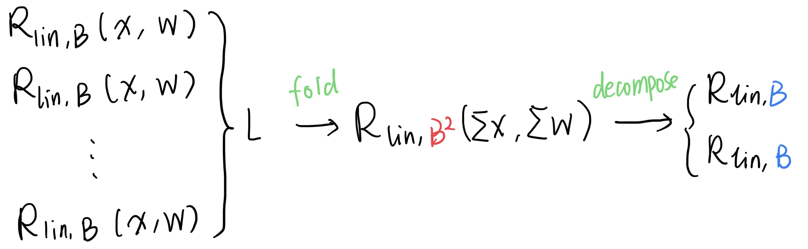
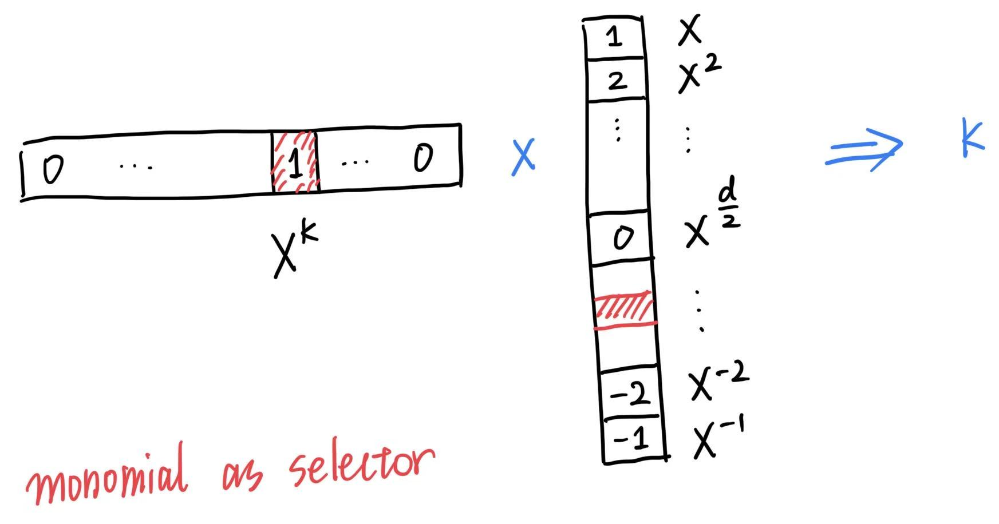
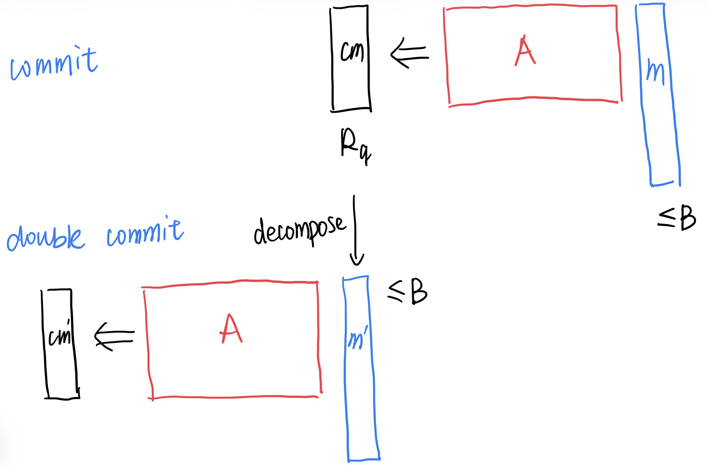
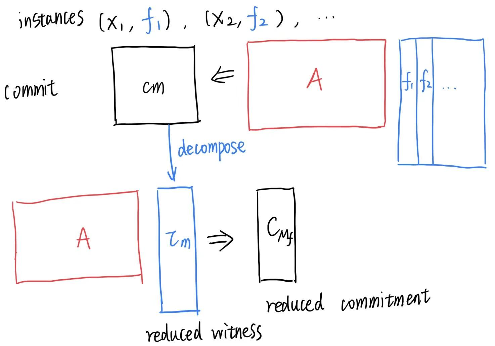
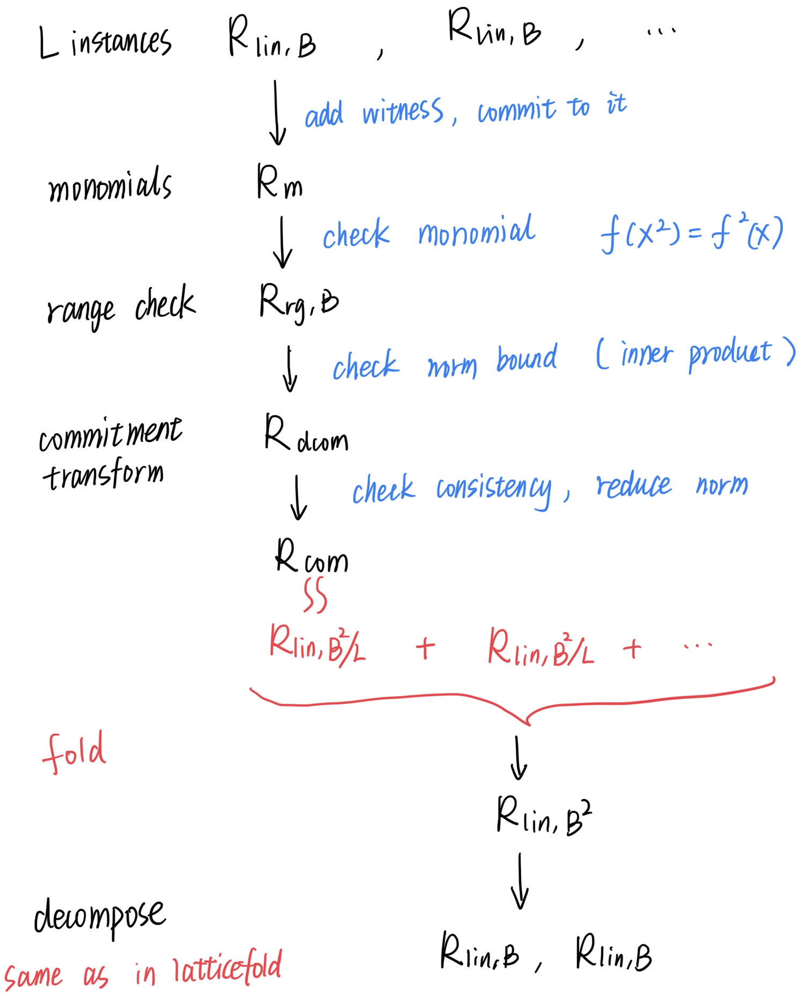

---
author:
  - name: Yingfei Yan
    affiliation:
    email: yingfeiyan1996@gmail.com 
---

# Overview of Latticefold+

## Introduction

Latticefold+ is an advanced folding framework that builds upon the foundations of Hypernova and Latticefold to provide efficient proof systems over lattice structures.

Latticefold+ introduces several critical improvements over existing approaches. The framework extends to multi-folding capabilities, allowing efficient composition of multiple proof instances. It incorporates new range check proofs to ensure witness elements remain within specified bounds, for the security. It also employs a double commitment scheme designed to address the witness size inflation typically introduced by range check protocols, maintaining efficiency while preserving the security.

---

## Framework Overview

Folding framework ( Hypernova + Latticefold )
1. Committed CCS to Linear CCCS
2. Decomposition
3. Fold: LCCCS x LCCCS to LCCCS
	- check norm bound
	- row check and linear check
  
Latticefold+ Improvement
	1. Multi-foldings
	2. Range check proof
	3. Double commitment(to reduce the witness size)

## 1. Notions

### 1.1 Cyclotomic rings
- $\mathbb{Z}_q = \mathbb{Z}/q\mathbb{Z}$
- $R = \mathbb{Z}[X]/(X^d + 1)$ is the ring of integers of the $2d$-cyclotomic field, where $d$ is a power of two.
- $R_q = \mathbb{Z}_q[X]/(X^d + 1)$
- $\Vert x \Vert_\infty = \mathsf{max}_{i\in n} (x_i)$ is the $\ell_\infty$ norm of a vector $\vec{x} \in \mathbb{R}^n$.
- $f$, an element over $R$ or $R_q$
- $\mathbf{b}$, bold, a vector over $R$ or $R_q$
- $\mathbf{b}[i], \mathbf{b}_i$, the $i$-th element of a vector $\mathbf{b}$.
- $\langle \mathbf{a} , \mathbf{b} \rangle$, inner product of two vectors $\mathbf{a} , \mathbf{b}$.

### 1.2 Relations
- $\mathcal{R}$, an NP relation
	- $\mathcal{R}_{comp}$, linear CCS, evaluation at a random point.
	- $\mathcal{R}_{lin,B}$, a general linear relation with norm bound $B$, committed linear CCS.
	- $\mathcal{R}_{acc}$, accumulation, 2 $\mathcal{R}_{lin,B}$ instances
	- $\mathcal{R}_{open} = \{(\mathbb{x,w}) = (\mathsf{cm}_\mathbf{f}, \mathbf{f})\}$, opening a commitment: $\mathbf{f}$ is a valid opening of the commitment $\mathsf{cm}_\mathbf{f}$.
	- $\mathcal{R}_{dopen} = \{ (\mathbb{x,w}) = (C,(\mathsf{cm}_\mathbf{f},\mathbf{f}))\}$, opening of a double commitment.

### 1.3 Operations
- $\mathsf{sgn}$, the sign of an integer, $\mathsf{sgn}(a) \in \{-1, 0, 1\}$.
- $\mathsf{exp}$, the operation that takes an integer exponent and maps it to a monomial element, $\mathsf{exp}(a) = X^a$.
- $\mathsf{EXP}$, the “border-aware” monomial operator,
$$
\mathsf{EXP}(a) :=
\begin{cases}
\{\mathsf{exp}(a)\} & \text{if } a \neq 0 \\
\{0, 1, X^{d/2}\} & \text{if } a = 0
\end{cases}
$$
- $\mathsf{pow}$, the vector form of $\mathsf{exp}$: it maps an integer vector to a vector over $R_q$ (or, depending on context, to a matrix).
- $\mathsf{com}$, computes the Ajtai commitment of the input vector.
- $\mathsf{dcom}$, computes the double commitment of the input vector
- $\mathsf{flat}$, flattens a matrix into a long vector by concatenating its column vectors
- $\mathsf{split}$, performs base-$d'$ decomposition on a matrix

## 2. Multi-Folding

Latticefold+ consists of three reductions of knowledge: commit, fold, and decompose, in the following steps.

**Step 1. Commit** 

Reduce the CCS relation $\mathcal{R}_{comp}$ to a general linear relation $\mathcal{R}_{lin,B}$.

In this step, the (reduction-of-knowledge) prover outputs the witness $\mathbb{w}$ and the statement $\mathbb{x}$ of the relation $\mathcal{R}_{lin,B}$.

$$%
\mathcal{R}_{lin,B} = \left\{ (\mathbb{i,x,w})
\middle|
\begin{aligned}
&\mathbb{x} = (\mathsf{cm}_\mathbf{f}, \mathbf{r}, \mathbf{v}_1, ..., \mathbf{v}_{n_{lin}}),\\
&\mathbb{w} = \mathbf{f},\\
&\mathsf{cm}_{\mathbf{f}} =
\mathsf{Com}(\mathbf{f}),\\
&\Vert \mathbf{f} \Vert_\infty < B,\\
& \forall i \in [n_{lin}],\; \langle \mathbf{M}^{(i)} \mathbf{f}, \mathsf{tensor}(\mathbf{r}) \rangle =\mathbf{v}_i
\end{aligned}
\right\}$$

Latticefold+ converts the CCS instances into linear committed CCS, which is called a “general linear relation” $\mathcal{R}_{lin,B}$.

This step is the same as Hypernova and Latticefold, except the commitment is improved to a double commitment.

**Step 2. Fold**

From $L \geq 2$ instances in $\mathcal{R}_{lin,B} \times ... \times \mathcal{R}_{lin,B}$ to $\mathcal{R}_{lin,B^2}$.

In this step, it folds the given $L$ instances of $\mathcal{R}_{lin,B}$ algebraically. In latticefold, there are only 2 CCS instances.

**Step 3. Decompose**

From $\mathcal{R}_{lin,B^2}$ back to 2 $\mathcal{R}_{lin,B}$ instances ($\mathcal{R}_{acc}$), using the B-nary decomposition technique (as in latticefold).

## 3. Tools

### 3.1 MLE over rings

The multilinear extension (MLE) of a function $f: \{0,1\}^k \to R$ is the unique multilinear polynomial $\tilde{f}: R^k \to R$ defined by:
$$\tilde{f}(\mathbf{x}) := \sum_{\mathbf{b}\in \{0,1\}^k} f(\mathbf{b}) \cdot eq(\mathbf{b},\mathbf{x}),$$
where the equality polynomial is
$$eq(\mathbf{b},\mathbf{x}) := \prod_{i\in[k]}[(1-\mathbf{b}_i)(1-\mathbf{x}_i) + \mathbf{b}_i\mathbf{x}_i].$$

To evaluate $\tilde{f}$ at a point $\mathbf{r} \in R^k$, we compute:
$$\tilde{f}(\mathbf{r}) = \sum_{\mathbf{b}\in \{0,1\}^k} f(\mathbf{b}) \cdot eq(\mathbf{b},\mathbf{r}).$$

#### Tensor/Inner Product Representation.

We can express the evaluation more efficiently using tensor products. For each $\mathbf{b} \in \{0,1\}^k$, the corresponding $eq(\mathbf{b},\mathbf{r})$ values form a vector of length $2^k$:
$$\begin{align*}
&\mathbf{b} = (0, \ldots, 0), \quad eq(\mathbf{b},\mathbf{r}) = \prod_{i\in[k]}(1-\mathbf{r}_i)\\
& \mathbf{b} = (0, \ldots, 0, 1), \quad eq(\mathbf{b},\mathbf{r}) = \mathbf{r}_k \cdot \prod_{i\in[k-1]}(1-\mathbf{r}_i)\\
&\vdots\\
&\mathbf{b} = (1, \ldots, 1), \quad eq(\mathbf{b},\mathbf{r}) = \prod_{i\in[k]}\mathbf{r}_i.
\end{align*}$$

This vector can be expressed as the tensor product $\mathsf{tensor}(\mathbf{r})$ : 
$$\left(\prod_{i\in[k]}(1-\mathbf{r}_i), \mathbf{r}_k \cdot \prod_{i\in[k-1]}(1-\mathbf{r}_i),\ldots,\prod_{i\in[k]}\mathbf{r}_i\right) = \bigotimes_{i\in[k]}(1-\mathbf{r}_i,\mathbf{r}_i).$$

Therefore, for the vector $\mathbf{f} = [f(\mathbf{b}_0), f(\mathbf{b}_1), \ldots, f(\mathbf{b}_{2^k-1})] \in R^{2^k}$, the MLE evaluation can be written as an inner product:

$\tilde{f}(\mathbf{r}) = \langle \mathbf{f}, \mathsf{tensor}(\mathbf{r}) \rangle.$

#### Why Tensor/Inner Product.

This tensor product representation provides an easier way to understand and compute MLEs, especially when the vector $\mathbf{f}$ lies over a structured ring, $R = \mathbb{Z}/(X^d+1)$, rather than a finite field $\mathbb{F}$. In this case, the evaluation of MLE is an element over $R$.

### 3.2 Range Check

While doing the commitment, we need to ensure that witness elements satisfy norm bounds, i.e., $w \in [-d, d]$ for some bound $d$. Latticefold+ introduces an efficient range check protocol that leverages the algebraic structure of cyclotomic rings.

The key insight is to represent bounded integers as monomials in the cyclotomic ring $R = \mathbb{Z}[X]/(X^d + 1)$. For a witness $w \in [-d/2, d/2]$, we can uniquely represent it as a monomial $X^w \in R$. The range check then reduces to verifying that a given ring element is indeed a monomial with degree in the allowed range.

#### 3.2.1 Protocol Description

The range check protocol consists of three main steps:

**Step 1: Monomial Encoding**
- Monomial set $\mathcal{M} = \{X, X^2, ..., X^{d-1}\} \in R$
- Assume $B \leq d/2$ for each witness $w \in [-B, B]$, compute the monomial encoding $\tau_w(X) = X^w \in R$
- The extended witness becomes $w' = (w, \tau_w(X))$

**Step 2: Monomial Verification**
- Verify that $\tau_w(X)$ is indeed a monomial by checking the relation $\tau_w(X^2) = X^{2w} = \tau_w^2(X)$
- Use the sumcheck protocol to verify it. This will fix $\tau_w(X)$ at a random evaluation point.

**Step 3: Degree Extraction and Range Check**
- Extract the degree of $\tau_w(X)$ to verify it lies in $[-B, B]$
- Use inner product techniques as a selector to extract the degree

#### 3.2.2 Challenges

This range check protocol introduces additional witnesses in the form of monomial polynomials $\tau_w(X)$. Storing and transmitting these auxiliary witnesses for all range checks would increase the proof size and communication complexity.

**Solution:** Latticefold+ addresses this challenge by employing double commitments to compress these intermediate witnesses, maintaining efficiency while preserving security.

### 3.3 Double Commitment

In this section, we discuss what a double commitment is and how to check if a double commitment is correct.

#### 3.3.1 Double Commitment

Like Greyhound and Labrador, Latticefold+ applies a double commitment to reduce communication costs. More precisely, this double commitment addresses the witness size increase introduced by the range check protocol.

In a word, a double commitment is a "commitment of a commitment." 
For a message matrix $\mathbf{M}$, its double commitment $\mathsf{cm}'$ is
$$\mathsf{cm'}:= \mathsf{com}(\mathsf{split}(\mathsf{com}(\mathbf{M}))).$$
The double commitment of Ajtai commitment is shown in the figure.

#### 3.3.2 Reduce Double Commitment to a Single Commitment

- Consistency: $\mathsf{dcom}$ and $\mathsf{com}$ are computed as in the above figure.

Once the verifier can check this consistency, we can reduce this double commitment to a single commitment, thereby simplifying the statement and reducing the witness size. 
This approach is particularly helpful when dealing with multiple CCS witnesses and the additional witnesses introduced in the range check protocols. 

Recall that in Latticefold, the witness size is controlled by performing decomposition. Here, a decomposition is implied in this double commitment approach because we need to perform decomposition on the first commitment.

For a double commitment statement $(cm_{\mathbf{m}_\tau}, C_{M_f}, cm_{\mathbf{f}})$ and its witness $(\tau, \mathbf{m}_\tau, \mathbf{f}, \mathbf{M}_f)$, 
	- $(cm_f, \mathbf{f})$ is the instance of the general linear relation.
	- to do the range check, we extend the coefficient of $\mathbf{f}$ to be a monomial matrix $M_f$.
	- to bind the witness, we commit to $M_f$ and add $\tau_D = \mathsf{com}(M_f)$ .
	- to reduce size (later), we double commit to $\tau_D$ and add $x = C_{M_f}, w = (\tau_D, M_f)$.
	- new norm bound on $\tau_D$, and additional witness monomial $\mathbf{m}_\tau$ of $\tau_D$.
	- again commitment $cm_{\mathbf{m}_\tau}$to the witness $\mathbf{m}_\tau$.

To reduce it, the verifier checks:
1. Check opening: linear check.
	1. linear witness **f** is an opening to commitment $cm_{\mathbf{f}}$;
	2. monomial extension $m_\tau$ is an opening to $cm_{m_\tau}$ ;
	3. $(\tau_D, M_f)$ is an double opening to $C_{M_f}$ ;
		- $M_f$ is an opening of (the composition of) $\tau_D$ 
		- $\tau_D$ is an opening of $C_{M_f}$
2. Check norm: this is done by doing the range check protocol.
	1. $\tau_D$ is in $(-B, B)^n$;
	2. the coefficients of **f** lie within $(-B, B)$;
	3. $\mathbf{m}_\tau$ is the monomial form of $\tau_D$.
	4. $M_f$ is the monomials form of $\mathbf{f}$.
3. Merge witnesses and commitments
	1. linear combination 
	2. with carefully selected challenge space.

## 4. Folding

