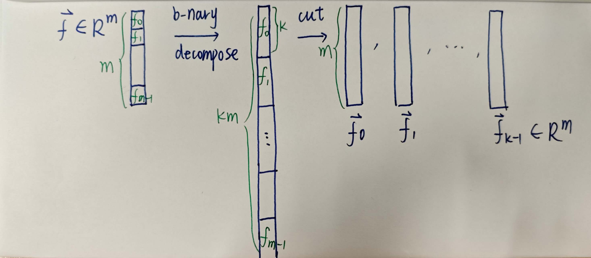
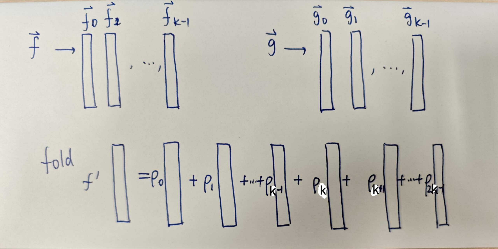
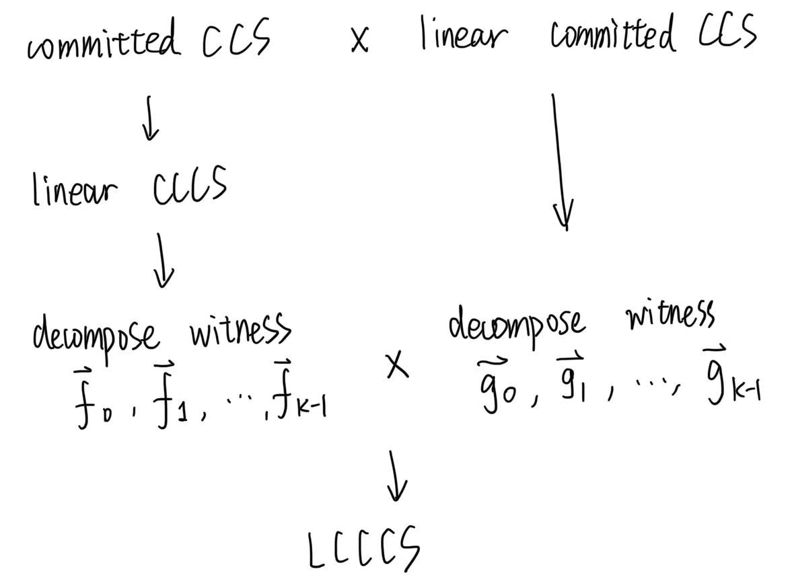

---
author:
  - name: Yingfei Yan
    affiliation:
    email: yingfeiyan1996@gmail.com 
---

# Latticefold: How to reduce witness size under Ajtai commitment

Recall that in Hypernova's folding, we can fold a committed CCS instance and a linear committed CCS instance to one LCCCS instance using an additively homomorphic commitment. 

To construct a folding scheme from lattice, the difficulty is ensuring that the committed witnesses are low norm through many rounds of folding.
As we have had the framework of Hyprenova(shown below), this time we will focus on this challenge is solved in Latticefold. 

1. Committed CCS to Linear CCCS
2. Fold: LCCCS x LCCCS to LCCCS

## 1. Ajtai commitment

Let $\mathcal{R} = \mathbb{Z}/(X^d+1)$ and $\mathcal{R}_q = \mathbb{Z}_q/(X^d+1)$ .

1. For a message vector $\mathbf{x} \in \mathcal{R}^m$ with infinity norm bound $|\mathbf{x}|_\infty \leq B$, the **Ajtai commitment** process is as follows:
    - **KeyGen**: Given the security parameter $\lambda$, generate a commitment key $\mathbf{A} \in \mathcal{R}_q^{n\times m}$.
    - **Com**: Given the commitment key $\mathbf{A} \in \mathcal{R}_q^{n\times x}$ and a message $\mathbf{x} \in \mathcal{R}^m$, compute the commitment $cm = \mathbf{Ax}$.

2. Ajtai commitment is additively homomorphic. 
    - $Com(\mathbf{x}_1) + Com (\mathbf{x}_2) = \mathbf{A} (\mathbf{x}_1 + \mathbf{x}_2)$.
    - the norm grows: $|\mathbf{x}_1 + \mathbf{x}_2|_\infty \leq 2B$

## 2. Control the Norm

We discuss how to control the witness size while folding. 
It consists of 2 steps: Decomposition and Fold.

### Decomposition

For a witness $\vec{f} \in \mathcal{R}^m$ of bounded norm $B$, decompose it into a tuple of vectors $\vec{f}_0, \ldots, \vec{f}_{k-1} \in \mathcal{R}^m$ of lower norm $b := \lceil B^{1/k} \rceil$. 

This decomposition works by writing every entry of $\vec{f}$ in base $b$, so that the original $\vec{f}$ satisfies $\vec{f} = \vec{f}_0 + b \cdot \vec{f}_1 + \ldots + b^{k-1} \cdot \vec{f}_{k-1}$, and each of the $k$ vectors has norm less than $b$. 

### Fold the witness

Given 2 decomposed witnesses $(\vec{f}_0, \ldots, \vec{f}_{k-1})$ and $(\vec{g}_0, \ldots, \vec{g}_{k-1})$ with lower bounded norm $b$. 

We compute a random linear combination of these $2k$ vectors using a random vector of weights $\vec{\rho}$ sampled as $\vec{\rho} \xleftarrow{\$} \mathcal{C}_{small}^{2k}$. 

By carefully selecting the low norm of $\rho$, we can make sure that the final folded witness $\vec{f}' := \sum_{i=1}^{2k} \rho_i \vec{f}_i$ has norm at most $B$.

## 3. Latticefold 

1. Committed CCS to Linear CCCS
    - use Ajtai commitment
    - fix CCCS at $\mathbf{0}$ to get linear CCCS
2. Decompose LCCCS witness
    - b-nary decomposition into $k$ witnesses
    - the verifier check decomposition
3. Fold LCCCS x LCCCS to LCCCS
    - fold $2k$ LCCCS (with norm bound $b$) into one LCCCS (with norm bound $B$)
    - the verifier check
        - 2 LCCCS instances: row check and linear check
        - $b$ norm bounded $2k$ witnesses

### Norm Check

The norm check protocol enables the prover to convince the verifier that a vector **f** ∈ $\mathcal{R}^m$ has norm less than $b$ by demonstrating that every component $u$ of **f** lies within the interval $[-b, b]$.

#### Polynomial Construction

This verification is achieved by proving that $g(u) = 0$ for each component, where $g(X)$ is the specifically constructed polynomial:

$$g(X) := X \prod_{i \in [b]} (X - i)(X + i)$$

The zeros of this polynomial $g$ are exactly the set $[-b, b]$, so $g(u) = 0$ if and only if $u \in [-b, b]$.

#### Proving the Norm Bound

To prove the norm bound of an $m$-dimensional vector $f$, we employ the following approach:
- **Multilinear Extension**: Extend $f$ to its multilinear polynomial $\tilde{f}(Y)$ over the Boolean hypercube $\{0,1\}^{\log m}$
- **Polynomial Evaluation**: Since $\tilde{f}(Y)$ agrees with $f$ on the Boolean hypercube $\{0,1\}^{\log m}$, we have $g(\tilde{f}(Y)) = 0$ for all $Y \in \{0,1\}^{\log m}$
- **Sumcheck**: Apply the sumcheck protocol to efficiently verify that $$\sum_{Y \in \{0,1\}^{\log m}} g(\tilde{f}(Y)) = 0$$

### The protocol

#### Step 1. Evaluation

Prover evaluates $\tilde{f}$ at $0^{\log m}$.  ($\tilde{f}$ is denoted by $\mathsf{mle}(\hat{f})$.)

#### Step 2. Decomposition

Split $\vec{f}$ and its evalution $\hat{\mathbf{v}}$, recompute the commitment $y$ to $\vec{f}_0, ..., \vec{f}_{k-1}$. 

#### Step 3. Fold 

This step follows the same folding approach as Hypernova, but includes an additional norm check.

- eq(15) is the Linear check (the same as Hypernova)
- eq(16) is the Norm check
- $\mathsf{NTT}(\hat{\mathbf{v}_o})$ is to fold the linear evalution $\hat{\mathbf{v}}$ 

For simplicity, we skipped NTT details from Latticefold.

## 4. Discussion

**Contributions:**

1. Introduces the 1st folding scheme from lattices.
2. Provides an elegant method for maintaining norm bound during foldings.

**Limitations:**

1. Only supports folding 2 instances at a time
2. The norm check introduces inefficiency due to the complexity of the polynomial g(X).
  

Next time we discuss how Latticefold+ achieves the multi-folding and improves the norm-check technique.
